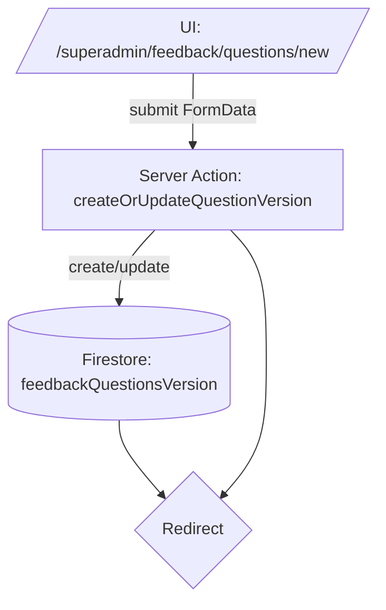

# Orderfly — Data Flow (Frontend → API/Actions → Firestore)

## Product Management Flow
```mermaid
flowchart TD
  A[/UI: /superadmin/products/new] -->|submit FormData| B[Server Action: createOrUpdateProduct]
  B -->|create/update| C[(Firestore: products)]
  C --> D{Redirect}
  B --> D
```

## Feedback Questions Flow


**Frontend:** Next.js App Router sider (server components) og formular-komponenter (client components).

**Server Actions/API:** Kald fra form submit → skriver/læser Firestore.

**Debug-endpoints:**
- `GET /api/debug/all` – Samlet health-check og nøgle-dokumenter.
- `GET /api/docs` – API-dokumentation.
