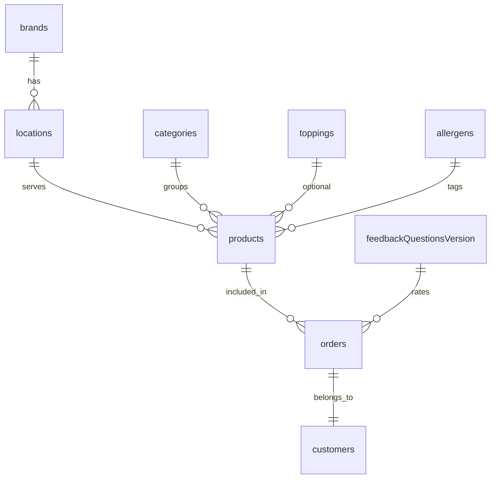

# Orderfly — Firestore Collections Overview

This document lists all Firestore collections used by the Orderfly platform,  
their schemas, dependencies, and how each collection connects Superadmin and the Frontend.

---

## 1. Core Collections

| Collection | Purpose | Used by | Created/Updated via |
|-------------|----------|----------|---------------------|
| **brands** | Defines brand-level identity, colors, and logo. | Superadmin, Frontend homepage | `src/app/superadmin/brands/actions.ts` |
| **locations** | Stores each restaurant location tied to a brand. | Superadmin, Frontend | `src/app/superadmin/locations/actions.ts` |
| **products** | Menu items with prices, allergens, toppings. | Superadmin (manage), Frontend (display) | `src/app/superadmin/products/actions.ts` |
| **categories** | Logical grouping of products for menu display. | Superadmin (manage), Frontend (menu filters) | `src/app/superadmin/categories/actions.ts` |
| **toppings** | Optional add-ons for products. | Superadmin (config), Frontend (selection) | `src/app/superadmin/toppings/actions.ts` |
| **allergens** | Lists allergen data connected to products. | Superadmin, Frontend | `src/app/superadmin/allergens/actions.ts` |
| **combos** | Defines combo menu structures. | Superadmin | `src/app/superadmin/combos/actions.ts` |
| **standardDiscounts** | Automatic brand-wide discounts. | Superadmin | `src/app/superadmin/standard-discounts/actions.ts` |
| **feedbackQuestionsVersion** | Versioned sets of post-order feedback questions. | Superadmin (config), Frontend (customer survey) | `src/app/superadmin/feedback/actions.ts` |
| **orders** | Finalized customer orders with payment status. | Frontend (checkout/confirmation), Superadmin (dashboard) | Stripe webhook + Firestore server write |
| **settings** | CMS-driven UI and brand content. | Superadmin CMS + Frontend | `src/app/superadmin/settings/actions.ts` |
| **customers** | Aggregated loyalty and order data. | Superadmin analytics | Automated aggregation logic |

---

## 2. Field Schemas (Simplified)

| Collection | Key Fields | Type | Required | Notes |
|-------------|-------------|------|----------|-------|
| **products** | `brandId` | string | ✅ | Reference to brand |
|  | `locationIds` | string[] | ✅ | Links product to one or more locations |
|  | `categoryId` | string | ✅ | Linked to `categories` |
|  | `productName` | string | ✅ | Display name |
|  | `price` | number | ✅ | Default price |
|  | `toppingGroupIds` | string[] | optional | Linked to `toppings` |
|  | `allergenIds` | string[] | optional | Linked to `allergens` |
|  | `isActive` | boolean | ✅ | Controls visibility |
|  | `createdAt` / `updatedAt` | timestamp | ✅ | System-managed |

| **orders** | `brandId`, `locationId`, `items[]`, `total`, `paymentStatus` | various | ✅ | Written via Stripe webhook |
| **feedbackQuestionsVersion** | `versionLabel`, `questions[]`, `language`, `orderTypes` | object | ✅ | Each version linked to specific order types |
| **categories** | `name`, `sortOrder`, `isActive` | string/number/bool | ✅ | Used to structure menu hierarchy |
| **toppings** | `groupName`, `items[]`, `maxSelectable` | string/array/number | ✅ | Defines topping selection rules |

---

## 3. Relationships Map

---

## 4. Collection Dependencies

| From                       | Depends On                                                   | Reason                                    |
| -------------------------- | ------------------------------------------------------------ | ----------------------------------------- |
| `products`                 | `brands`, `locations`, `categories`, `toppings`, `allergens` | Defines contextual links                  |
| `orders`                   | `products`, `customers`, `brands`, `locations`               | For analytics and receipts                |
| `feedbackQuestionsVersion` | `orders`                                                     | Post-order survey mapping                 |
| `customers`                | `orders`                                                     | Aggregated statistics and loyalty scoring |

---

## 5. Data Ownership

* **Write Source:** Always through Server Actions (marked `'use server'`) or automated webhook functions.
* **Read Source:**

  * *Frontend:* Next.js Server Components (read-only).
  * *Superadmin:* Realtime reads + Firestore Admin SDK.

---

## 6. Related Docs

* `/docs/data-communication.md` — Communication paths
* `/docs/data-flow.md` — System data flows
* `/docs/architecture.md` — Global architecture diagram
* `/docs/firestore-schema.md` — Detailed field-level schemas
