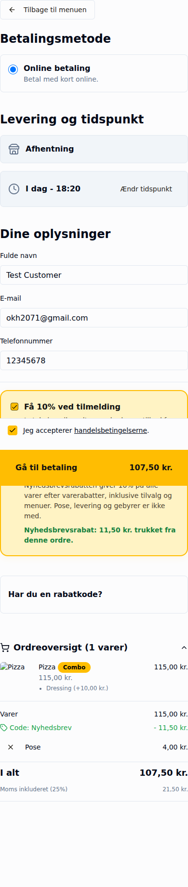
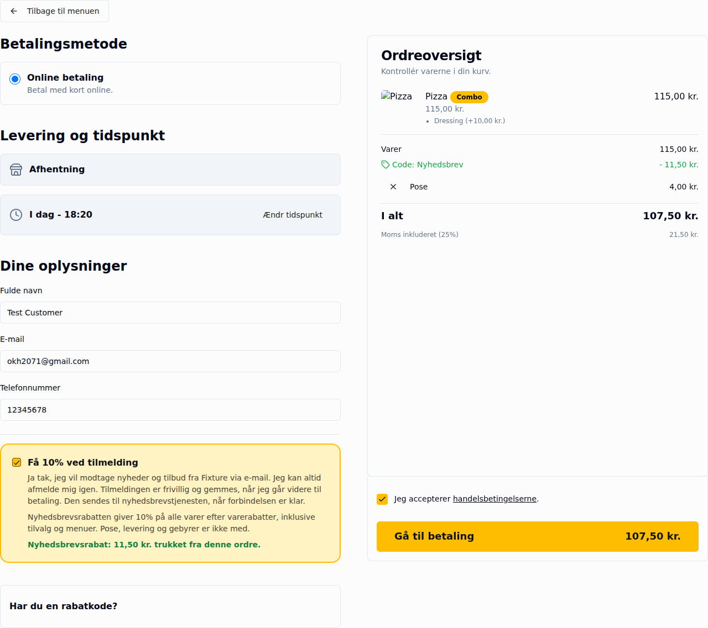

# Promotion / administration / checkout QA, 1 October 2026

Branch: `fix-promotion-admin-qa`, based on main `246f59d`.
Sources reviewed: #209, #193, #187, #192 (including their QA comments), and #210.

**Not deployed. No issue is verified resolved in production.** This is a code-level repair and local regression report. No production campaign, customer, consent, order, payment, reservation, or provider record was changed. There are no temporary production campaigns to restore. Browser runs were restricted to basket/checkout and never clicked payment. Customer identification in the new browser checks uses `okh2071@gmail.com`.

## Findings and changes

| Observation | Confirmed in this source / local reproduction | Change | Verification and remaining gate |
|---|---|---|---|
| 1. Newsletter missing | Administration infers `newsletter_signup` for legacy `NEWSLETTER_SIGNUP`, while checkout required an explicit type. Lookup also returned the first qualifying campaign using gross subtotal for all campaigns. Missing marketing configuration deliberately returns no offer. **Which condition affected QA's actual record is not yet established.** | Shared interpretation on public lookup and redemption; reserved marker cannot be manually redeemed. Choose greatest eligible saving using the appropriate charged/undiscounted merchandise base. Refresh lookup when eligibility changes. Admin shows a redacted, brand-authorized configuration explanation; preserves the provider-config gate. | Legacy campaign, wrong location, inactive/future/expired, minimum and missing config tested. Preview performs no writes/provider calls. Live configuration/customer/campaign diagnostics still required. |
| 2. Date goes back one day | Picker used local midnight → ISO UTC → first ten characters. Copenhagen selections become the preceding date. End timestamps were also midnight rather than the whole end day. | Calendar strings avoid UTC slicing. New/changed dates use Copenhagen boundaries, including 23:59:59.999 on the end day. Existing unchanged dates retain their exact instant. Danish calendar/date formatting. | October 2/4, September 19 and both DST boundaries pass under UTC, Copenhagen and Los Angeles process zones. No bulk migration. Historical truncated end dates need individual review; this PR does not silently extend them. |
| 3–5. New discount, combos and locations crash | They share raw brand/location objects crossing the server/client boundary; existing discount edit already normalized these. Nested Firestore Timestamp prototypes reproduce unsafe props. Locations also lacked the page-level 401/403 handling. **No deployed stack trace was obtained to prove this is the sole live cause.** | Normalize complete authorized brand/location records using the existing serializer, retain unnamed locations with an identifiable label, and use the existing scoped page gate for locations. Never replace database failures with empty lists. | Shared record tests, new-discount/list rendering, expired/denied session and propagated database-error tests pass. Live loading of all three routes and admin create/edit/reopen remain acceptance gates. |
| 6. Upsell edit Access Denied | List and edit both use `orderfly.catalog:view`. List can expose company-scoped historical rows, but detail/save rejected deleted location references. The existing discount editor already had safe orphan handling. **Actual QA upsell references still need live inspection; no wrong role mapping was established.** | Apply the existing company-grant-only orphan policy to upsell and combo detail/edit. Current foreign locations and newly invented missing locations remain forbidden; retain `catalog:view/edit` mapping and native ownership checks. | Actual upsell action opens/saves a historical fixture, preserves metrics, repairs its location and rejects denied/foreign edits. Browser tests cover offer/add/remove/dismiss; server tests cover trigger/pricing rejection. QA's live campaign still needs verification. |
| 7. Type switch not saved | Every newsletter gets the reserved marker, which previously collided with any existing newsletter under the ordinary code-uniqueness check. Client validation had no persistent invalid-submit summary. Entering newsletter mode also overwrote per-customer limit with 1. | Uniqueness remains enforced for real codes. Newsletter campaigns may share the non-redeemable marker. Preserve document ID, usage and existing fields; append prior code/type to application history on a transition. Persistent server/client error summary; keep configured customer limit. Reverse conversion requires an actual code. | Convert QA-named synthetic code alongside an existing newsletter and reopen: type, usedCount and references retained. No reservation reset, deletion or new campaign ID. Real-record save/reload still pending. |
| 8. Standard stacking misleading | Evaluators deliberately do not provide general item/code stacking. UI exposed an active switch anyway. | Disabled unchecked control with policy explanation. Existing stored values are not migrated. Newsletter's separate switch remains functional. | Pricing regressions preserve best cart discount and the newsletter exception. |
| Inclusive minimum / Danish amounts | Inclusive checks were paired with “over” and dot-decimal errors. | “Mindst” descriptions; Danish amount strings in minimum/conflict/delivery errors. Upsell `cart_value_over` remains **strictly greater** and is not relabelled as inclusive. | Below/exact/above boundary and #192 conflict regressions pass. |
| Open basket stale | Provider restored campaigns only on initialization/scope changes, using the public menu cache. Product price guard rejected undercharges but allowed an older, higher price after a better item offer appeared. Cart discounts could silently be recomputed during order creation. | Uncached restore on focus/every 30 seconds; discard in-flight responses after cart edits/scope changes. Revalidate current product offer ceiling. Modern checkout sends zero explicitly and server compares displayed quote components before customer/consent/order/reservation writes. | Real CartProvider browser test changes a campaign and price without reload. Stale code/cart/item quotes fail with no writes. Existing quantity/option/reservation tests pass. |

## Test evidence

- `npm run typecheck`: passed.
- 159 targeted Node tests: 159 passed, 0 failed, 0 skipped.
- 6 local Chromium basket/checkout tests: 6 passed, 0 failed. No payment submissions.
- Date subset repeated with `TZ=Europe/Copenhagen` and `TZ=America/Los_Angeles`: 6/6 each.
- `git diff --check`: clean.

Node regression command:

```sh
node --test tests/unit/{promotion-qa-209,newsletter-discount,discount-conflict-192,automatic-discounts,promotion-review,legacy-promotion-details,orphaned-promotion-scope,upsell-form-data,superadmin-promotion-pages,checkout-price-validation,cart-restore,native-selector-access,location-catalog-access,omnisend-193,checkout-reliability,commerce-p1}.cjs
```

Browser command (a working local Playwright Chromium executable is required):

```sh
node --test --test-name-pattern='QA209' tests/unit/{checkout-browser,cart-browser}.cjs
```

Coverage includes percent/fixed product/category/cart offers, toppings at full price, quantity tiers, repeated bundles/remainders/no surcharge, cheapest 3-for-2, minimum boundaries, inactive and scoped campaigns, weekday/window rules, delivery minima/free delivery, supported combo selections, competing automatic discounts/codes, newsletter minimum/stacking/fees/opt-out, and reservation/settlement idempotency. Server tests use in-memory data and mocked payment/provider I/O; they do not create real payments or send messages.

The older screenshot test submitted deliberately false totals (999) expecting silent server correction. It now submits the actual computed quote, with separate tests proving false/stale quotes are rejected before writes. Assertions were updated for the requested comma formatting and Copenhagen date semantics, not removed.

## Combo limitation: do not overstate the 115 kr check

The pricing and UI fixture represents 115 kr of charged combo merchandise (105 + 10), producing **11.50 kr discount and 107.50 kr including the 4 kr bag**. Stacking off and opt-out restore 119 kr. These checks do **not** prove persistence or server acceptance of QA's actual upgrade/topping model.

On this baseline, `cart-snapshot.ts` retains combo product IDs; `cart-restore.ts` rejects top-level toppings on combos and does not reconstruct per-product combo topping/upcharge selections. `upgradeProductIds` is used for product-to-combo recommendations, not a per-option price contract. Therefore the exact “95 + 10 Pepperoni + 10 Dressing” live configuration must be inspected and reconciled with the deployed source before that acceptance item can be signed off. This PR deliberately does not invent a new option-pricing schema or claim that local total arithmetic proves this flow.

## #210 reservations and paid sales

The stale-held-reservation observation remains open. This PR does not expire a hold based on age, reset `usedCount`, alter settlement/cancellation logic, or alter paid-sales aggregation. Existing reservation serialization, uncertain-payment and duplicate-webhook tests pass. Type changes preserve the same campaign ID used by holds and order references. No production sales totals were changed or newly measured.

## Release / live acceptance

Keep #209/#193/#187 and the #210 reservation investigation open. #192's existing policy remains unchanged. Review the code, obtain actual production error digests/stack traces and the selected campaign's redacted readiness/eligibility evidence, then follow PO acceptance → merge → deployment → live verification. No deployment was requested or performed as part of this PR.

Admin browser verification was not performed because this task restricts browser retesting to basket/checkout. Live route loading, code/newsletter creation, combo edit/save/reopen, location settings, and actual upsell save must be verified by the authorized release/QA flow. Any temporary live campaign used there must be restored and QA rules disabled afterwards.

Screenshots are **local React fixtures**, not deployed/live evidence:




